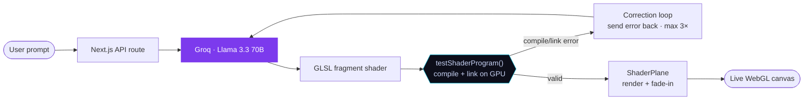

<div align="center">

# 🎨 Shade.ai

### Type a vibe. Watch a GPU shader write, compile, and fix itself — live.

Shade.ai turns a plain-language prompt into a real-time WebGL fragment shader. The twist: when the generated GLSL fails to compile, the **exact GPU error is fed back to the model**, which rewrites the code until it runs — a self-healing loop you can watch happen.

*Microsoft Agents League · Creative Apps track*


</div>

---

## Why it's interesting

Most "AI generates code" demos hand you code and hope it runs. Shade.ai closes the loop: it **validates every shader against a real GPU** (compile **and** link), and treats a compiler error not as a dead end but as the next turn of a conversation. The agentic correction loop is visible in the UI — you see the GPU error and the fix happen in real time.

---

## Architecture



### The self-correction loop

1. The prompt + full conversation go to the API route, which calls **Llama 3.3 70B** on Groq with a shader-specialist system prompt.
2. The returned GLSL is validated by `testShaderProgram()` using the renderer's **own** WebGL context: it compiles the vertex + fragment shaders (`COMPILE_STATUS`) and links them into a program (`LINK_STATUS`).
3. **On failure**, the full info-log is sent back to the model as a new turn — *"this is the GPU error, fix it"* — up to **3 attempts**.
4. **On success**, the shader is mounted on a fullscreen quad and fades in. The previous valid shader is *never* replaced by an unvalidated one.

> **Why link, not just compile?** A fragment shader can compile alone yet fail when linked with the vertex shader — surfacing as `THREE.WebGLProgram: VALIDATE_STATUS false`. Validating compile **and** link, on the renderer's real context, catches those before they ever reach the visible canvas.

---

## Reliability

- **Validated-only rendering** — the GPU only ever receives a shader that passed compile + link. A failed generation keeps the last valid shader on screen.
- **No leaked contexts** — validation reuses the renderer's WebGL context instead of allocating throwaway ones (which the browser caps at ~16, silently breaking validation).
- **Bounded correction loop** — max 3 self-heal attempts, then a clear message.
- **Hardened API route** — validates request shape, caps message length, bounds conversation growth, and fails with a readable error if `GROQ_API_KEY` is missing.

## Accessibility

- **`prefers-reduced-motion`** — freezes the shader's time uniform (holds a developed frame) and disables all UI animation, without breaking the render.
- **Keyboard-first** — every control is a native, focusable element with a visible focus ring.
- **Screen readers** — status uses `aria-live`; the prompt input, generate, copy-GLSL, and screenshot controls have ARIA labels.

---

## Stack

| Layer | Tech |
|---|---|
| Framework | **Next.js 16** (App Router, Turbopack) |
| Language | **TypeScript** |
| Styling | **Tailwind CSS v4** |
| 3D / WebGL | **React Three Fiber** + **three.js** |
| State | **Zustand** |
| AI | **Groq** · `llama-3.3-70b-versatile` |

---

## Run it

```bash
npm install
echo "GROQ_API_KEY=gsk_your_key_here" > .env.local
npm run dev          # → http://localhost:3000
```

Type a prompt or click an example chip. Use **Copy** to grab the GLSL, **PNG** (bottom-right of the canvas) to export the current frame.

---

## Project structure

```
src/
├── app/
│   ├── api/shader/route.ts   # validated, hardened LLM endpoint
│   ├── page.tsx              # split layout: canvas + chat panel
│   └── globals.css           # design tokens, animations, a11y
├── components/
│   ├── ShaderCanvas.tsx      # R3F Canvas, fade-in reveal, PNG export
│   ├── ShaderPlane.tsx       # validation gate + reduced-motion freeze
│   └── ChatPanel.tsx         # prompt, visible correction loop, code viewer
├── lib/
│   ├── glsl.ts               # extractGLSL() + testShaderProgram() (compile+link)
│   ├── shaderDefaults.ts     # domain-warped FBM nebula (default shader)
│   └── prompts.ts            # shader-specialist system prompt
└── store/
    └── useShaderStore.ts     # generate → compile → fix state machine
```

---

## Built with GitHub Copilot

Shade.ai was developed with **GitHub Copilot** as an AI pair programmer in VS Code — scaffolding the React Three Fiber pipeline, iterating on the GLSL system prompt, and debugging the WebGL compile/link flow. The self-correcting development loop Copilot enables in the editor is exactly what Shade.ai puts on stage: a model that writes, tests, and fixes its own GPU code.

---

<div align="center">
<sub>Microsoft Agents League · Creative Apps · 2026</sub>
</div>
