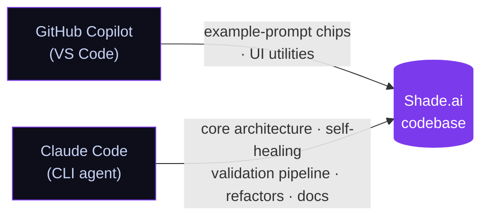
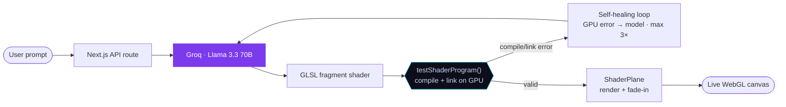

<div align="center">

# 🎨 Shade.ai

### Type a vibe. Watch a GPU shader write, compile, and fix itself — live.

🔗 **Live Demo:** https://shade-ai-nine.vercel.app


*Microsoft Agents League · Creative Apps track*


</div>

## Table of contents

- [What it does](#what-it-does)
- [The self-healing loop](#the-self-healing-loop)
- [Features](#features)
- [Architecture](#architecture)
- [Tech stack](#tech-stack)
- [Getting started](#getting-started)
- [How it was built](#how-it-was-built)
- [License](#license)

## What it does

Shade.ai turns a plain-language prompt — *"aurora borealis over a dark ocean"* — into a real-time WebGL fragment shader running full-screen in your browser. Once a shader is live, you keep talking to it: *"make it darker and slower"* edits the running GLSL instead of starting over. Every shader is validated on your actual GPU before it ever reaches the canvas.

## The self-healing loop

Most "AI writes code" demos hand you code and hope it runs. Shade.ai treats the GPU as the referee — **this is not a syntax check; it's real WebGL validation against real driver output**:

1. The prompt and full conversation go to **Llama 3.3 70B** on Groq with a shader-specialist system prompt.
2. The returned GLSL is validated by `testShaderProgram()` using the renderer's **own** WebGL context: it compiles the vertex + fragment shaders (`COMPILE_STATUS`) **and links them into a program** (`LINK_STATUS`).
3. **On failure**, the exact GPU info-log is fed back to the model as the next conversation turn — *"this is the GPU error, fix it"* — for up to **3 attempts**. The whole loop is visible in the UI: you watch the error appear and the fix land.
4. **On success**, the shader fades in on a fullscreen quad. A failed generation never replaces the last valid shader.

> **Why link, not just compile?** A fragment shader can compile in isolation yet fail when linked with the vertex shader — surfacing in three.js as `VALIDATE_STATUS false`. Validating compile **and** link, on the renderer's real context, catches those before they ever reach the visible canvas.

## Features

- **Natural language → GLSL, in real time** — type a vibe, get a living shader in seconds.
- **Self-healing loop, visible to the user** — the agentic correction steps (generate → compile on GPU → catch error → fix) render live in the panel, GPU error log included.
- **Conversational refinement** — with a shader live, *"darker"*, *"slower"*, or *"add caustics"* make surgical edits that preserve the shader's structure and identity instead of regenerating from scratch.
- **Code export** — copy any shader as a ready-to-paste **React (R3F) component** or a **standalone HTML file** that runs by double-clicking it.
- **PNG export** — capture the current frame straight from the canvas.
- **Accessible by default** — `prefers-reduced-motion` freezes the time uniform (holds a developed frame instead of killing the render), every control is keyboard-focusable with visible focus rings, and status updates announce via `aria-live`.

## Architecture

### Development workflow

Shade.ai was built with AI-assisted development, with each tool in a distinct role:



### Runtime pipeline



```
src/
├── app/
│   ├── api/shader/route.ts   # validated, hardened LLM endpoint (generate + refine modes)
│   ├── layout.tsx            # metadata, OG/Twitter cards
│   ├── page.tsx              # split layout: canvas + chat panel
│   └── globals.css           # design tokens, animations, a11y
├── components/
│   ├── ShaderCanvas.tsx      # R3F Canvas, fade-in reveal, PNG export
│   ├── ShaderPlane.tsx       # validation gate + reduced-motion freeze
│   └── ChatPanel.tsx         # prompt, visible correction loop, code viewer, export menu
├── lib/
│   ├── glsl.ts               # extractGLSL() + testShaderProgram() (compile + link)
│   ├── exportTemplates.ts    # shader → R3F component / standalone HTML
│   ├── shaderDefaults.ts     # domain-warped FBM nebula (default shader)
│   └── prompts.ts            # generation + refinement system prompts
└── store/
    └── useShaderStore.ts     # generate → compile → fix state machine
```

**Reliability guarantees** baked into the pipeline:

- **Validated-only rendering** — the material only ever receives a shader that passed compile + link; failures keep the last valid shader on screen.
- **No leaked contexts** — validation reuses the renderer's WebGL context instead of allocating throwaway ones (browsers cap live contexts at ~16, which silently breaks naive validators).
- **Bounded loop** — max 3 self-heal attempts, then a clear, non-destructive error message.
- **Hardened API route** — validates request shape, caps message length, bounds conversation growth, and fails with a readable error if the API key is missing.

## Tech stack

| Layer | Tech |
|---|---|
| Framework | **Next.js 16** (App Router, Turbopack) |
| Language | **TypeScript 5** |
| 3D / WebGL | **React Three Fiber 9** + **three.js** |
| Shaders | **GLSL ES 1.00** (WebGL1-compatible) |
| AI | **Groq** · `llama-3.3-70b-versatile` |
| State | **Zustand** |
| Styling | **Tailwind CSS v4** |
| Hosting | **Vercel** |

## Getting started

```bash
git clone https://github.com/CamiloCalder0n/shade-ai.git
cd shade-ai
npm install

# Get a free API key at https://console.groq.com
echo "GROQ_API_KEY=gsk_your_key_here" > .env.local

npm run dev   # → http://localhost:3000
```

Type a prompt or click an example chip. With a shader live, use **Refine** to iterate on it, **Export** to copy it as R3F/HTML code, **Copy** for the raw GLSL, or **PNG** (bottom-right of the canvas) to save the current frame.

## How it was built

Shade.ai was built with AI-assisted development, human-directed throughout, using two tools in distinct roles:

- **GitHub Copilot** (in VS Code) — contributed the example-prompt chips and small UI utilities.
- **Claude Code** (Anthropic's CLI coding agent) — the core architecture, the self-healing GPU validation pipeline, refactors, and documentation.

That workflow is also the thesis of the project — the same *write → run → read the real error → fix* loop that built the app is what the app performs on stage, with the GPU as the compiler.

## License

[MIT](LICENSE) © 2026 CamiloCalder0n

---

<div align="center">
<sub>Microsoft Agents League · Creative Apps · 2026</sub>
</div>
